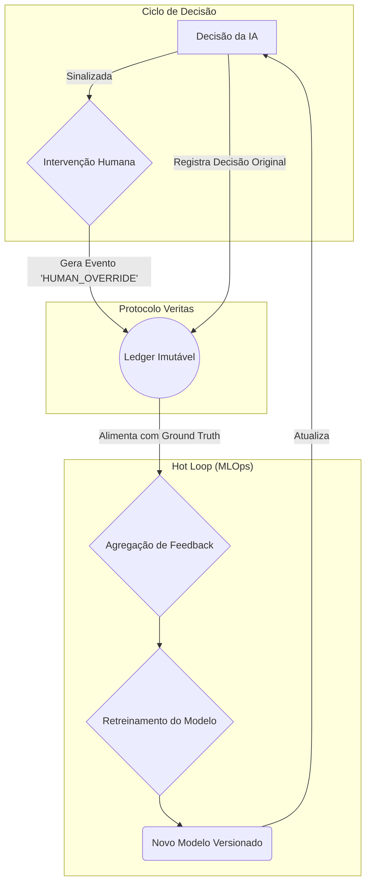
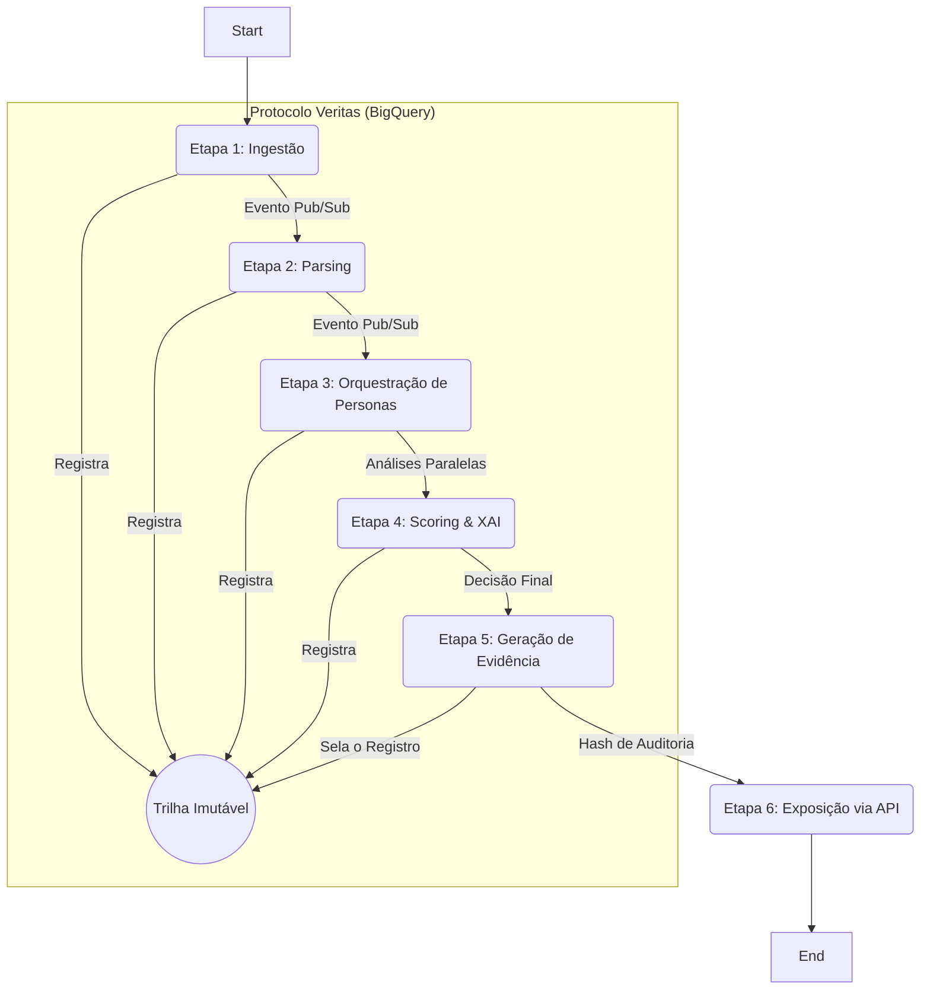

# README: Uma Proposta de Infraestrutura de Confiança Auditável para o BTG Pactual

## 1\. Sumário Executivo: Convertendo o Passivo Regulatório em Ativo Computacional

Esta documentação apresenta a **Infraestrutura de Confiança Auditável (ATI)** da FoundLab, uma arquitetura de Layer 0 (infraestrutura fundamental) projetada para o setor financeiro.

A tese central é que a conformidade regulatória, atualmente um dos maiores centros de custo e passivos de risco para o BTG Pactual, pode e deve ser transformada em um ativo estratégico gerador de valor: o **"Alpha Operacional"**.

A plataforma FoundLab (codinome "Umbrella") não é uma ferramenta RegTech incremental. É uma re-arquitetura de primeiros princípios que resolve o dilema central do setor: o conflito entre a inovação ágil, a segurança de dados (LGPD) e a retenção imutável de provas (SOX, BACEN).

Nós movemos a confiança de um processo humano, caro e probabilístico, para uma **propriedade matemática, de baixo custo e determinística** do sistema.

-----

## 2\. Os Três Pilares da Infraestrutura de Confiança (ATI)

A defensibilidade da plataforma é construída sobre a sinergia de três pilares arquitetônicos.

### Pilar 1: Zero-Persistence (Segurança Radical)

Este pilar implementa a filosofia de que "o dado mais seguro é aquele que não existe", tratando dados sensíveis em repouso como um "passivo tóxico".

  * **Implementação Técnica:** Dados sensíveis de clientes **nunca são armazenados em disco** na camada de aplicação. O processamento ocorre exclusivamente em **memória volátil (RAM)** dentro de contentores *stateless* e efêmeros no **Google Cloud Run**.
  * **Controlo de Estado Transitório:** Para a comunicação entre serviços, o **Memorystore (Redis)** é usado com um **Time-To-Live (TTL) mandatório e agressivo (\< 60 segundos)**.
  * **Impacto:** Elimina arquitetonicamente a classe de risco de violações de dados em massa (vazamento de base de dados), garantindo conformidade nativa com a **LGPD (Minimização de Dados)**.

### Pilar 2: Protocolo Veritas (Auditabilidade Absoluta)

Este pilar substitui logs de texto frágeis por **prova matemática irrefutável**. É o nosso "cartório digital".

  * **Implementação Técnica:**
    1.  **Chave de Custódia (`DecisionID`):** Cada transação recebe um ID único que amarra todo o seu ciclo de vida, desde a ingestão até a prova final.
    2.  **Encadeamento de Prova (`Hash-Chaining`):** Cada evento na trilha de auditoria é "selado" criptograficamente, contendo o hash do evento anterior (`previousChainHash`). Qualquer adulteração quebra a cadeia e é matematicamente detectável.
    3.  **Ledger Imutável (WORM):** A trilha de auditoria é persistida no **Google BigQuery**, configurado como **Write-Once, Read-Many** (WORM).
  * **Impacto:** Garante a não-negação e a integridade da prova, satisfazendo os requisitos de retenção da **SOX** e a rastreabilidade do **BACEN/CVM**.

### Pilar 3: Inteligência Antifrágil (A Vantagem Composta)

Este pilar garante que a plataforma não apenas resista a falhas, mas **aprenda e melhore com elas**.

  * **Implementação Técnica:**
    1.  **Fallback Auditado:** Uma arquitetura Multi-Engine (Google Gemini + NVIDIA NIMs) garante que, se um motor de IA primário falhar, um secundário assume. O evento de falha (`ENGINE_FAILURE`) e o de *fallback* são registados no Protocolo Veritas.
    2.  **Critic-Loop:** Um agente de IA "crítico" revisa as saídas das IAs "analistas" para detetar inconsistências ou "alucinações" *antes* da decisão final.
    3.  **IA Flywheel (Hot Loop):** Este é o ciclo de aprendizagem. Quando um humano corrige uma decisão (um evento `HUMAN_OVERRIDE`), essa correção é registada no Veritas e usada como *ground truth* para retreinar e aprimorar os modelos de IA.
  * **Impacto:** Transforma um custo operacional (correção de erros) num ativo de dados para melhoria contínua do modelo.

<!-- end list -->

-----

## 3\. A Solução para o Paradoxo Regulatório (SOX vs. LGPD)

A arquitetura resolve o conflito central de *compliance*: "nunca apagar" (SOX) versus "apagar sob demanda" (LGPD).

A solução é **desacoplar a existência física dos dados da sua legibilidade criptográfica**.

1.  **Garantia SOX (Retenção):** O Cofre WORM (Pilar 2) garante que os *bytes* da prova nunca são fisicamente apagados.
2.  **Garantia LGPD (Deleção):** O **CMEK (Customer-Managed Encryption Keys)** atua como o "kill switch" regulatório. Para "apagar" dados, a *chave* de criptografia é destruída. Os dados cifrados (ilegíveis) permanecem no cofre, satisfazendo a SOX, mas os dados pessoais tornam-se permanentemente inacessíveis, satisfazendo a LGPD.

-----

## 4\. O Pipeline Operacional (Fluxo de Decisão E2E)

A plataforma opera num pipeline assíncrono (Pub/Sub) e *serverless* (Cloud Run), com um SLO de performance (p95 \< 520ms).

| Etapa | Ações Principais | Outputs Chave |
| :--- | :--- | :--- |
| **1. Ingestão** | Recebe documento em memória volátil; Gera `DecisionID` e `DocumentHash`; Inicia trilha Veritas. | `DecisionID` para o cliente; Evento no Pub/Sub. |
| **2. Parsing** | Usa **Google Document AI** para converter documento em JSON canônico; Extrai entidades (NER). | JSON estruturado e enriquecido. |
| **3. Orquestração** | **Cognitive Orchestrator** despacha análise em paralelo para **Personas de IA** especializadas. | Análises agregadas de múltiplas IAs. |
| **4. Scoring & XAI** | Agrega análises; Calcula **Score Composicional**; Gera **`Rationale`** (justificativa XAI); Executa **Critic-Loop**. | Decisão final com score e explicação. |
| **5. Geração de Evidência** | Consolida trilha; Gera **`AuditTrailHash`** final; Sela o registro no BigQuery; Entrega resultado assinado com **JWS**. | Pacote de decisão final e auditável. |

-----

## 5\. A Proposta para o BTG Pactual: O Modelo "Soberania Absoluta"

Entendemos que uma instituição de Nível 1 como o BTG Pactual não pode abdicar da soberania sobre seus dados. A nossa resposta não é um modelo SaaS inflexível, mas o **Modelo On-Prem/Dedicated**.

Esta arquitetura implementa a plataforma FoundLab **diretamente na VPC do Google Cloud do BTG**, garantindo que o banco mantenha o controlo e a custódia final sobre a infraestrutura, os dados e as chaves.

### A "Trindade da Confiança" para o BTG Private Bank

Este modelo é construído sobre três pilares técnicos de soberania:

1.  **Custódia Final de Chaves (CMEK/HSM):** O BTG provisiona e gere as suas próprias chaves de criptografia (CMEK), opcionalmente protegidas por **Cloud HSM** (FIPS 140-2 Nível 3). A FoundLab apenas recebe permissão de *uso*. A desativação da chave pelo BTG atua como um **"kill switch" regulatório**, tornando os dados instantaneamente inacessíveis.
2.  **Perímetro de Dados Impenetrável (VPC-SC):** O **VPC Service Controls** é ativado para bloquear, por defeito, toda a tentativa de exfiltração de dados para fora do perímetro do BTG, mesmo que uma credencial seja comprometida.
3.  **Conexão Segura (PSC):** A integração usa **Private Service Connect**, uma conexão unidirecional e não-transitiva, arquitetonicamente superior ao VPC Peering.

### Conformidade Regulatória (BACEN)

Este modelo atende diretamente à Resolução CMN nº 4.893/2021:

  * **Custódia dos Logs Veritas:** A trilha de auditoria é escrita no BigQuery WORM de **propriedade e custódia do BTG**.
  * **Acesso do BACEN (Art. 14):** O BTG concede acesso direto ao regulador, eliminando a FoundLab como intermediário.
  * **Controle e Supervisão (Art. 11-13):** O BTG mantém a *Accountability* (A) no modelo RACI sobre a governação, como aprovação de GMUDs e gestão de acessos.

### Integração com Sistemas Legados (Core Banking)

A arquitetura mitiga o risco de integração com sistemas *core banking* através do padrão **Anti-Corruption Layer (ACL)**. A ACL atua como um "tradutor" que isola o domínio moderno da FoundLab da dívida técnica dos sistemas legados, permitindo uma integração segura e gradual.

-----

## 6\. Validação de Valor: O "Alpha Operacional"

A tese da FoundLab foi validada no ecossistema BTG (com o parceiro Elitte Capital), provando a geração de "Alpha Operacional".

| Métrica | Antes da FoundLab | Depois da FoundLab | Melhora Quantificada |
| :--- | :--- | :--- | :--- |
| **Ciclo de Conformidade** | 21 horas | 16 minutos | **Redução de 98,7%** |
| **Taxa de Erro** | 42% | 2,5% | **Redução de 94%** |

Este *benchmark* demonstra a capacidade da plataforma de transformar radicalmente a eficiência operacional, libertando capital humano e reduzindo o risco.

## 7\. Conclusão

A Plataforma Umbrella da FoundLab é uma infraestrutura de missão crítica que redefine a conformidade. Ao combinar **Zero-Persistence**, **Auditabilidade Absoluta (Veritas)** e **Inteligência Antifrágil**, a plataforma não apenas mitiga riscos, mas transforma o custo da conformidade num ativo com retorno sobre o investimento (ROI) mensurável, auditável e exponencial.

A nossa proposta para o BTG Pactual é a implementação do **Modelo Dedicated**, uma arquitetura de soberania absoluta que entrega esta vantagem competitiva dentro do perímetro de segurança e controlo total do banco.
