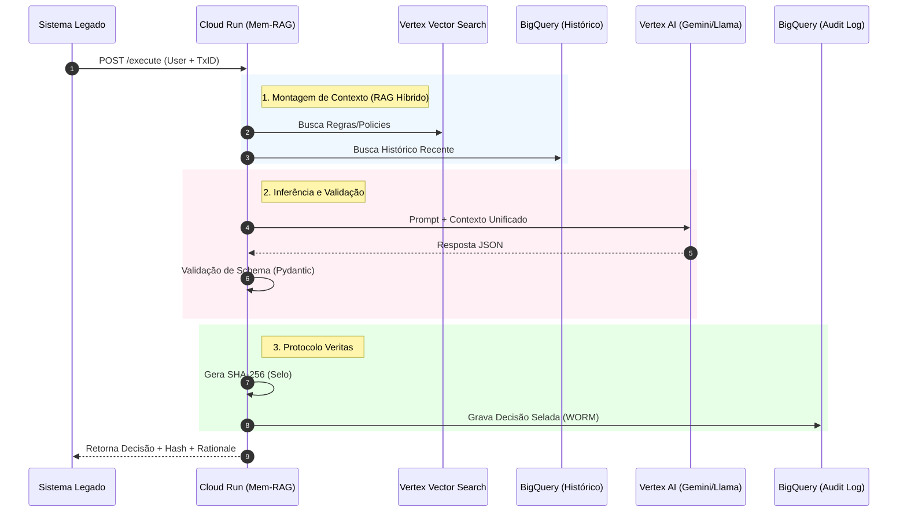

\<p align="center"\>  
\  
\</p\>

\<div align="center"\>

# **FoundLab — Mem-RAG V2 Compliance Orchestrator**

### **Google Cloud Platform Edition**

\<p align="center"\>  
\<a href="\#-overview"\>\\</a\>  
\<a href="\#-arquitetura-da-solução"\>\\</a\>  
\<a href="\#-proposta-de-valor-a-arma-regulatória-protocolo-veritas"\>\\</a\>  
\<a href="\#%EF%B8%8F-licença"\>\\</a\>  
\</p\>  
\</div\>

## **📋 Visão Geral: Quebrando o Paradigma da Caixa-Preta**

**Kernel de Conformidade Serverless para IA Generativa em Ambientes Regulados.**

**O Desafio da Confiança em IA Generativa.** A revolução da IA prometeu eficiência, mas esbarrou no muro da regulamentação. Em setores como **Bancos, Seguradoras e FinTechs**, a incerteza de um modelo de "caixa-preta" é um risco de compliance insustentável.

**O Mem-RAG V2 Compliance Orchestrator** foi construído para quebrar esse paradigma. Esta solução **não é um chatbot**; é o **Kernel de Conformidade Serverless** que transforma LLMs de máquinas probabilísticas em **mecanismos de decisão auditáveis, determinísticos e criptograficamente selados**.

### **🎯 Projetado para o Trilema da Adoção de IA:**

1. **Auditabilidade:** Rastreio criptográfico de cada decisão (Protocolo Veritas).  
2. **Controle:** Prevenção ativa de alucinações via *Schema Constraint*.  
3. **Privacidade:** Arquitetura *Stateless* e *Zero-Trust*.

## **📚 Índice**

* [🏛️ Proposta de Valor: A Arma Regulatória (Protocolo Veritas)](https://www.google.com/search?q=%23%25EF%25B8%258F-proposta-de-valor-a-arma-regulat%C3%B3ria-protocolo-veritas)  
* [🗺️ Arquitetura da Solução](https://www.google.com/search?q=%23%25EF%25B8%258F-arquitetura-da-solu%C3%A7%C3%A3o)  
* [🚀 Guia de Implementação (3 Passos)](https://www.google.com/search?q=%23-guia-de-implementa%C3%A7%C3%A3o-3-passos)  
* [🧪 Exemplo de Saída (Selo Veritas)](https://www.google.com/search?q=%23-exemplo-de-sa%C3%ADda-selo-veritas)  
* [⚙️ Referência Técnica (API)](https://www.google.com/search?q=%23%25EF%25B8%258F-refer%C3%AAncia-t%C3%A9cnica-api)  
* [⚠️ Riscos e Mitigações](https://www.google.com/search?q=%23%25EF%25B8%258F-riscos-e-mitiga%C3%A7%C3%B5es)  
* [📝 Apêndice Técnico](https://www.google.com/search?q=%23%25F0%259F%2593%258D-ap%C3%AAndice-t%C3%A9cnico)

## **🏛️ Proposta de Valor: A Arma Regulatória (Protocolo Veritas)**

**Introdução:** O Protocolo Veritas é o coração da nossa proposta. Ele define os padrões de **rastreabilidade** e **imutabilidade** necessários para sustentar a defesa legal e regulatória de qualquer decisão automatizada.

| Recurso | Benefício Técnico Chave |
| :---- | :---- |
| **🔒 Selagem Criptográfica** | Cada transação é assinada com um hash **SHA-256** (Input \+ Contexto \+ Output), criando uma prova forense imutável da decisão. |
| **🧠 Colapso de Esquema** | O LLM é forçado a aderir a um JSON Schema estrito. A falha na adesão resulta em um **Fail-Safe** (Erro 422), impedindo alucinação estrutural. |
| **💾 Memória WORM** | O Selo Veritas é registrado em tabelas BigQuery configuradas como **Write-Once, Read-Many**, garantindo auditabilidade regulatória. |
| **🧬 RAG Híbrido** | Combina **Memória Semântica** (Regras/Leis no Vector Search) e **Memória Episódica** (Histórico do cliente no BigQuery/SQL) para contexto de alta precisão. |

## **🗺️ Arquitetura da Solução**

**Introdução:** A robustez de uma solução de IA em ambiente regulado depende da arquitetura. O Mem-RAG V2 é um microsserviço *stateless* implantado no Cloud Run, orquestrando nativamente os serviços mais confiáveis do Google Cloud para performance e segurança.

A solução implanta um endpoint único no **Cloud Run** que orquestra todo o fluxo cognitivo utilizando serviços nativos do Google Cloud.

### **Fluxo de Decisão (Sequence Diagram)**




### **Componentes GCP Utilizados**

* **Compute:** Cloud Run (Serverless, Auto-scale).  
* **AI/ML:** Vertex AI Model Garden & Vertex AI Vector Search.  
* **Data:** BigQuery (Analytics & Audit) ou Cloud SQL.  
* **Segurança:** IAM, Secret Manager e suporte a **VPC Service Controls**.

## **🚀 Guia de Implementação (3 Passos)**

**Introdução:** Projetamos o processo de deploy para ser o mais rápido e previsível possível. Com apenas 3 passos via Terraform, sua infraestrutura de compliance estará operacional dentro do seu projeto Google Cloud.

Blueprint desenhado para **deploy-em-um-clique** via Google Cloud Marketplace utilizando Terraform.

### **Passo 1 — Pré-requisitos**

No seu projeto GCP, certifique-se de que estes recursos já existem no projeto de destino:

* ✅ **Processador LLM:** Endpoint na Vertex AI Model Garden.  
* ✅ **Memória Semântica:** Índice no Vertex AI Vector Search.  
* ✅ **Memória Episódica:** Tabela no BigQuery ou instância Cloud SQL.

### **Passo 2 — Deploy (Terraform)**

1. Clone o repositório:

    ```bash
    git clone https://github.com/foundlab-cloud/mem-rag-gcp-marketplace.git
    cd mem-rag-gcp-marketplace/deployment
    ```

2. Crie e configure o `terraform.tfvars`:

    ```hcl
    project_id              = "seu-projeto-id"
    region                  = "us-central1"
    deployment_name         = "memrag-prod"
    vertex_model_endpoint   = "projects/seu-projeto/locations/..."
    vertex_vector_index     = "projects/seu-projeto/locations/..."
    episodic_store_bq_table = "seu_dataset.historico_transacoes"
    ```

3. Execute a implantação:

    ```bash
    terraform init
    terraform apply
    ```
   O Terraform retornará a URL do seu endpoint do Cloud Run.
### **Passo 3 — Onboarding e Teste (CLI memragctl)**


Utilize a CLI para ingestão de dados e testes de sanidade.

**Teste Rápido (Smoke Test):**

```bash
# Crie um arquivo de teste
echo '{"user_id": "u-123", "transacao_id": "tx-999"}' > teste.json

# Execute contra o endpoint gerado pelo Terraform
memragctl test ./teste.json --url "https://memrag-prod-xxxxx.a.run.app"
```
## **🧪 Exemplo de Saída (Selo Veritas)**

**Contexto:** Ao invés de uma resposta textual ambígua, o orquestrador retorna este objeto JSON, que serve como o **Selo Veritas** auditável, rastreando a decisão e as evidências utilizadas.

```json
{
  "veritas_hash": "a45b0f6c2e9d4f...9f2c",
  "timestamp": "2025-11-14T12:34:56.789Z",
  "request_data": {
    "user_id": "user-123",
    "transacao_id": "txn-abc"
  },
  "decision_data": {
    "decision": "REVIEW",
    "rationale": "Transação excede limite diário (Regra R-10) e histórico do cliente é recente.",
    "evidence_refs": ["REG-004", "user_history:txn-abc"],
    "risk_score": 0.75
  }
}
```

## **⚙️ Referência Técnica (API)**

**Introdução:** A API foi desenhada para ser consumida de forma simples e segura por barramentos corporativos e microsserviços internos.

### **Endpoint: POST /v1/execute**

Executa o pipeline completo de RAG, Inferência e Auditoria.

| Campo | Tipo | Descrição |
| :---- | :---- | :---- |
| user\_id | String | Identificador único do usuário para busca de histórico. |
| transacao\_id | String | ID do evento/transação atual. |
| dados\_contextuais | Object | (Opcional) Payload arbitrário com detalhes da transação. |

Retorno de Sucesso (200 OK): Objeto JSON contendo o SeloVeritas (estrutura acima).  
Erro de Compliance (422 Unprocessable Entity): Retornado se o LLM não conseguir aderir ao schema ou se as regras de negócio bloquearem.

## **⚠️ Riscos e Mitigações**

**Introdução:** A FoundLab projeta soluções para operação de longo prazo (*Day-2 Operations*). Esta tabela resume os riscos mais comuns em IA Generativa em produção e como o Mem-RAG V2 os endereça.

| Cenário de Risco | Solução Mem-RAG (Mitigação) |
| :---- | :---- |
| **Alucinação Estrutural** | Validador Pydantic rejeita JSONs inválidos. Transação é abortada com erro 422 (Fail-Safe). |
| **Auditoria Regulatória** | Tabelas WORM no BigQuery garantem que logs de decisão nunca sejam alterados ou deletados. |
| **Custo Elevado de LLM** | Arquitetura 100% Serverless (Cloud Run). Pague apenas por invocação. |
| **Drift de Modelo** | O veritas\_hash e o risk\_score permitem monitoramento contínuo de mudanças no padrão de decisão. |

## **📝 Apêndice Técnico**

**Introdução:** Esta seção contém referências detalhadas para Arquitetos de Solução e Engenheiros de Plataforma, incluindo o contrato de dados de saída e as variáveis de implantação do Terraform.

### **🧩 Variáveis de Implementação (Terraform)**

Parâmetros configuráveis durante o deploy.

| Variável | Obrigatório | Descrição |
| :---- | :---- | :---- |
| project\_id | Sim | ID do Projeto Google Cloud de destino. |
| region | Sim | Região para Cloud Run, BQ e outros recursos. |
| deployment\_name | Sim | Prefixo dos recursos (ex.: memrag-prod). |
| vertex\_model\_endpoint | Sim | Recurso do modelo (Gemini/Llama) na Vertex AI. |
| vertex\_vector\_index | Sim | Endpoint do Vector Search. |
| episodic\_store\_bq\_table | Sim\* | Tabela BigQuery para histórico (\*se usar BQ). |
| audit\_table\_name | Não | Nome da tabela WORM de auditoria (Default: memrag\_v2\_decisions). |

### **🧾 Output Contract (JSON Schema Resumido)**

O contrato de saída que a solução garante para o seu microsserviço.

```json

{

  "type": "object",

  "properties": {

    "veritas_hash": { "type": "string", "description": "SHA-256 da transação." },

    "decision_data": {

      "type": "object",

      "properties": {

        "decision": { "enum": ["ALLOW", "REVIEW", "BLOCK"], "description": "Decisão final do pipeline." },

        "rationale": { "type": "string", "description": "Explicação concisa do raciocínio." },

        "risk_score": { "type": "number", "min": 0.0, "max": 1.0, "description": "Pontuação de risco." }

      }

    }

  }

}

```


## **⚖️ Licença**

Distribuído sob a licença **Apache 2.0**. Veja o arquivo LICENSE para mais detalhes.

\<p align="center"\>  
\<strong\>FoundLab Cloud Solutions\</strong\>

\<em\>Building Trust in Generative AI.\</em\>  
\</p\>
