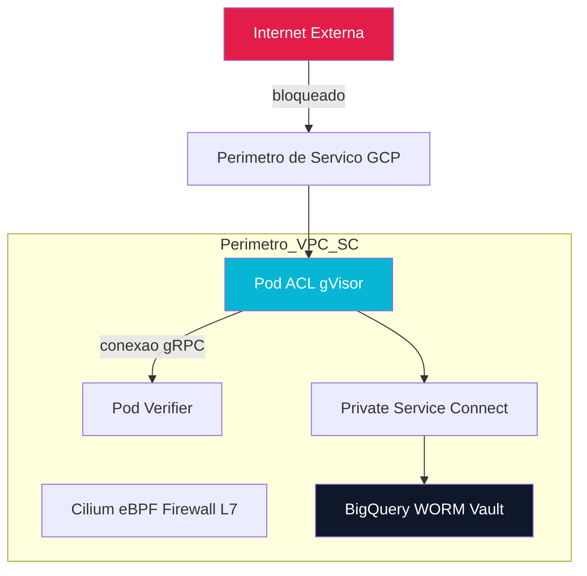
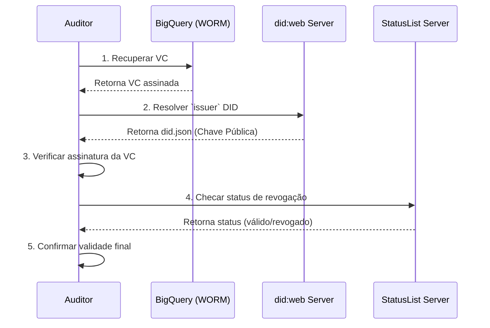
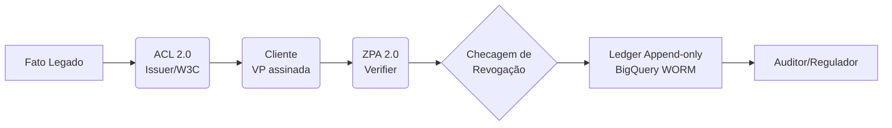

# FoundLab Veritas 2.0

***A demonstração de que o que antes era tido como impossível, é agora possível, anula a impossibilidade anterior, mesmo que realizar o impossível já fosse concebível.***

## I. O Paradigma "Veritas": Projetando para Imutabilidade e Não-Negação Regulatória

A arquitetura "FoundLab Veritas 2.0" não é definida por seus componentes de software, mas sim por um conjunto rigoroso de imperativos legais e regulatórios. Esses mandatos, provenientes de agências federais dos EUA, incluindo a Federal Trade Commission (FTC), o Department of Justice (DOJ) e a Securities and Exchange Commission (SEC) através da Lei Sarbanes-Oxley (SOX), formam os requisitos não funcionais. Esses requisitos ditam uma arquitetura de "verdade" (Veritas) que deve priorizar a imutabilidade, a auditabilidade criptográfica e a conformidade "à prova de falhas".

### A. O Mandato da FTC: Dados com Hash *São* PII

O primeiro pilar da arquitetura "Veritas" é uma resposta direta à postura inflexível da FTC sobre a privacidade dos dados. A FTC tem avaliado rotineiramente as práticas de tratamento de dados das empresas em relação às suas representações de privacidade. Uma falha comum que a agência identifica é a alegação incorreta de que dados pessoais foram "anonimizados".

Historicamente, as organizações têm usado "hashing" — um processo matemático que transforma dados (como um e-mail ou número de telefone) em uma string aparentemente aleatória (um "hash") — sob a suposição de que isso torna os dados anônimos. A lógica é que o hash, como "2813448ce6316cb70b38fa29c8c64130" para um número de telefone fictício, parece sem sentido e não pode ser facilmente revertido para **inferir** os dados originais. As empresas então afirmam que isso preserva a privacidade do usuário.

A FTC rejeita veementemente essa lógica, rotulando-a como "tão antiga quanto falha". A agência reafirmou sua orientação de 2012 de que o hashing *não* constitui anonimização. A razão é que o hashing é determinístico: os mesmos dados de entrada sempre criarão o mesmo hash. Isso permite que identificadores com hash sejam usados para rastrear e identificar usuários ao longo do tempo, e seu uso indevido ainda pode levar a danos. A FTC adota um padrão rigoroso: "os dados só são anônimos quando nunca podem ser associados de volta a uma pessoa".

**Implicação Arquitetônica "Veritas":** O paradigma "Veritas" deve operar sob a premissa de que *não há distinção prática* entre PII bruta e PII com hash (pseudônimos) em termos de controles de segurança. Se um log de auditoria contém um `hashed_user_id`, esse log deve ser tratado com o mesmo nível de proteção que um log contendo o `user_id` bruto. Alegações de anonimização por hashing são consideradas "enganosas" pela FTC. Portanto, todos os dados que podem ser "associados de volta a uma pessoa" estão sujeitos **à** totalidade dos controles de perímetro (VPC Service Controls), criptografia (CMEK) e retenção (SOX) da arquitetura.

### B. O Mandato da SOX: O Cofre WORM de Sete Anos

O segundo pilar é impulsionado pelos rigorosos requisitos de retenção de registros da Lei Sarbanes-Oxley (SOX). A SOX foi projetada para prevenir fraudes corporativas e exige um nível específico de imutabilidade para registros financeiros e de auditoria.

Duas seções são de importância crítica para a arquitetura:

1.  **Retenção de Sete Anos:** A Regra 2-06 da SEC (17 CFR 210.2-06), promulgada sob a SOX, exige que os contadores retenham registros relevantes para auditorias e revisões por um período de **sete anos**. Isso não se limita a relatórios financeiros formais. O escopo é amplo, cobrindo "workpapers e outros documentos que formam a base da auditoria ou revisão". A Seção 802 da SOX estende isso para incluir todos os "registros (incluindo registros eletrônicos)", o que engloba memorandos, correspondência e comunicações. Os auditores são especificamente obrigados a manter seus documentos de auditoria por pelo menos 7 anos.
2.  **Armazenamento WORM (Write-Once-Read-Many):** O requisito mais desafiador tecnicamente é o formato de armazenamento. Os registros devem ser mantidos de forma a "impedir alterações ou exclusões não autorizadas". A lei exige armazenamento em um formato "à prova de violação", "não regravável, não apagável", comumente conhecido como WORM (Write-Once-Read-Many).

**Implicação Arquitetônica "Veritas":** A arquitetura "Veritas" deve tratar todos os logs do sistema, eventos de decisão e metadados de transação como "workpapers de auditoria eletrônica" sob a SOX. O sistema de armazenamento central (detalhado na Seção III) deve, portanto, ser projetado desde o início como um "Cofre WORM" que impõe tecnicamente a política de retenção de 7 anos e a imutabilidade de "gravação única".

### C. O Mandato do DOJ: O Crime de "Contemplar" a Exclusão

O terceiro pilar é a ameaça legal mais potente que molda a arquitetura: o estatuto de destruição de evidências da SOX, codificado como **18 U.S.C. § 1519**. Este estatuto redefine drasticamente o risco associado às políticas de retenção de dados.

Antes da SOX, a acusação de obstrução de justiça sob 18 U.S.C. § 1512 era difícil. Ela exigia que os promotores provassem a "persuasão corrupta" (ou seja, dizer a outra pessoa para destruir evidências) e, sob 18 U.S.C. § 1505, geralmente exigia a existência de um "processo pendente".

A Seção 802 da SOX introduziu o § 1519, que a orientação de campo do DOJ confirma ser muito mais amplo. O § 1519 se aplica a *qualquer pessoa* (o "triturador individual") que "com conhecimento de causa altere, destrua, mutile, oculte, encubra, falsifique ou faça uma entrada falsa em qualquer registro".

O elemento crítico é a intenção. A lei se aplica a atos realizados "com a intenção de impedir, obstruir ou influenciar a investigação ou administração adequada de qualquer assunto" ou "em relação a ou *em contemplação de* qualquer" investigação. Isso significa que uma investigação *não* precisa estar pendente. Um funcionário que destrói arquivos porque *teme* que uma investigação *possa* ser iniciada está violando o § 1519. Como um artigo da Federal Lawyer observa, mesmo uma "política de retenção de documentos que é... seguida" é apenas uma defesa, não uma imunidade, e deve ser suspensa quando uma investigação é "pendente ou *contemplada*".

**Implicação Arquitetônica "Veritas" (O Paradoxo da Retenção):** Esses mandatos legais criam um paradoxo arquitetônico:

1.  A **FTC** (Seção I-A) exige que os logs com hash sejam tratados como PII.
2.  A **SOX** (Seção I-B) exige que esses logs, se relacionados à auditoria, sejam mantidos por 7 anos em formato WORM.
3.  O **DOJ** (Seção I-C) torna um crime (§ 1519) excluir esses logs, mesmo através de uma política de retenção "rotineira", se uma investigação for meramente "contemplada".
4.  Simultaneamente, **Leis de Privacidade** (como GDPR e CCPA, que são requisitos de negócios padrão) exigem que as empresas *excluam* PII mediante solicitação do usuário (o "Direito de Ser Esquecido").

A arquitetura "Veritas" está, portanto, sujeita a demandas legais contraditórias: "nunca exclua" (DOJ/SOX) versus "exclua sob demanda" (Privacidade).

A única solução arquitetônica viável para esse paradoxo é **desacoplar a existência física dos dados de sua legibilidade criptográfica**. O sistema "Veritas" deve, portanto:

1.  Armazenar *todos* os registros de auditoria em um cofre WORM (BigQuery, Seção III) para satisfazer a SOX/DOJ. Os dados *nunca* são fisicamente excluídos ou atualizados.
2.  Implementar um "kill switch" criptográfico de nível regulatório (CMEK, Seção V) para "excluir" dados sob demanda. Isso é feito tornando os dados permanentemente ilegíveis (um processo chamado "crypto-shredding") sem violar a imutabilidade física do cofre WORM, resolvendo assim o paradoxo.

## II. A Fundação da Infraestrutura: Isolamento de Confiança Zero no Nível do Kernel e da Rede

Para atender aos mandatos da Seção I, a arquitetura "Veritas" deve operar dentro de uma "cidadela" de infraestrutura que assume uma violação e impõe a contenção em várias camadas. O sistema deve proteger não apenas contra ameaças externas, **mas** também contra movimento lateral interno e exfiltração de dados por insiders comprometidos. Esta fundação é construída sobre três camadas de isolamento: processo, rede e perímetro de serviço.

### A. Isolamento de Carga de Trabalho Multi-Tenant (Kubernetes)

O "Veritas" deve ingerir dados de uma variedade de fontes, incluindo sistemas legados não confiáveis e entradas de usuários. Esses processos de ingestão devem ser rigorosamente isolados do núcleo do sistema e uns dos outros (multi-tenancy) para evitar a contaminação da infraestrutura.

#### 1. gVisor (GKE Sandbox): O Kernel de Espaço de Usuário

A primeira linha de defesa é o isolamento no nível do processo, fornecido pelo gVisor (implementado no Google Kubernetes Engine (GKE) como GKE Sandbox).

O gVisor não é um hipervisor de máquina virtual tradicional nem um simples filtro de chamada de sistema. É uma solução de isolamento de carga de trabalho de código aberto que implementa um "kernel de aplicação" ou "kernel de espaço de usuário". Sua arquitetura consiste em um componente central chamado "Sentry", que funciona como um kernel distinto por sandbox. O Sentry intercepta e lida com chamadas de sistema (syscalls) dos contêineres em execução dentro da sandbox.

Ao mover a implementação da interface do sistema para o espaço do usuário, o gVisor reduz drasticamente a superfície de ataque direta ao kernel do host. Isso permite que a arquitetura "Veritas" execute "código não confiável" — como os pods do "Anti-Corruption Layer" (ACL) (discutidos na Seção V) que processam dados arbitrários de sistemas legados — com uma camada extra de isolamento. Mesmo que um invasor explore o processo de ingestão, ele fica preso dentro da sandbox do gVisor, incapaz de acessar o kernel do host para escapar do contêiner. O gVisor é explicitamente projetado para casos de uso como o processamento de grandes conjuntos de dados de terceiros ou serviços que executam código de usuário não confiável.

#### 2. Cilium e eBPF: A Rede Ciente da Identidade

A segunda linha de defesa é o isolamento no nível da rede. Se um pod protegido por gVisor for comprometido, a arquitetura deve impedir que o invasor realize reconhecimento de rede ou movimento lateral. O Cilium, construído sobre a tecnologia eBPF do Linux, fornece essa capacidade.

O eBPF é uma tecnologia de kernel do Linux que permite que programas de bytecode dinâmicos sejam inseridos e executados em vários pontos de gancho do kernel, como E/S de rede e soquetes de aplicativos. O Cilium utiliza o eBPF para ir além de uma CNI (Container Networking Interface) tradicional. Em vez de aplicar políticas de rede baseadas em endereços IP (L3/L4), que podem ser facilmente falsificados, o Cilium fornece "isolamento de rede ciente da identidade" e aplicação de políticas de L7 (nível de aplicação).

No "Veritas", o Cilium aplica políticas de rede baseadas na *identidade criptográfica* do serviço (por exemplo, um SPIFFE ID) em vez de seu endereço IP. Uma política Cilium pode declarar: "Pods com a identidade `role: acl-ingestor` SÓ podem iniciar conexões gRPC para o serviço com a identidade `role: vc-issuer` na porta 443, e nada mais." Se o pod `acl-ingestor` comprometido tentar varrer a rede ou contatar o banco de dados de credenciais, o kernel do Linux, instruído pelo eBPF, bloqueará a conexão no nível do soquete.

### B. Definindo o Perímetro de Dados (GCP)

A terceira e mais forte linha de defesa é o perímetro no nível do serviço em nuvem. Esta camada protege o "cofre" de dados (BigQuery) de *toda* a infraestrutura, incluindo administradores e serviços comprometidos que possuem credenciais válidas.

#### 1. VPC Service Controls (VPC-SC): O Perímetro de Exfiltração

O VPC Service Controls (VPC-SC) é um recurso de segurança do Google Cloud que mitiga os riscos de exfiltração de dados. É fundamental entender que o VPC-SC fornece uma camada de defesa *independente* do Identity and Access Management (IAM). O IAM foca em *quem* pode acessar recursos (controle de acesso baseado em identidade), enquanto o VPC-SC foca em *de onde* os recursos podem ser acessados e quais dados podem cruzar os limites definidos (segurança de perímetro baseada em contexto).

O VPC-SC cria um "perímetro de segurança" em torno de um conjunto de projetos e recursos do Google Cloud, como buckets do Cloud Storage ou conjuntos de dados do BigQuery. Por padrão, a comunicação dentro do perímetro é irrestrita, mas a comunicação com serviços *fora* do perímetro é bloqueada.

O VPC-SC protege contra ameaças sofisticadas:

-   **Credenciais Roubadas:** Se um invasor roubar credenciais de conta de serviço (um token OAuth), ele não poderá usá-las. Mesmo com permissões de IAM válidas, qualquer chamada de API (por exemplo, `gcloud storage cp` para um bucket público) originada de *fora* do perímetro (por exemplo, da máquina do invasor) será negada.
-   **Insider Malicioso ou Código Comprometido:** O VPC-SC impede que clientes *dentro* da rede autorizada (como um pod Kubernetes comprometido) acessem recursos do Google *fora* do perímetro.
-   **Políticas de IAM Mal Configuradas:** Mesmo que uma política de IAM exponha publicamente os dados, o VPC-SC fornece uma camada de segurança secundária, negando o acesso de redes não autorizadas.

No "Veritas", o cofre BigQuery WORM reside dentro de um perímetro VPC-SC rigorosamente definido, tornando a exfiltração de dados quase impossível.

#### 2. Private Service Connect (PSC): A Ponte Levadiça Privada

Enquanto o VPC-SC constrói os "muros do castelo", o Private Service Connect (PSC) fornece a "ponte levadiça" segura e controlada. O PSC é uma capacidade de rede do Google Cloud que permite o *consumo privado* de serviços gerenciados.

Em vez de os pods de ingestão do "Veritas" acessarem a API pública do BigQuery pela Internet, o PSC permite que os produtores de serviços (neste caso, o Google BigQuery) exponham um endpoint de serviço *privado* diretamente dentro da rede VPC do consumidor (a rede VPC do "Veritas"). O tráfego entre os pods de ingestão e o BigQuery permanece inteiramente dentro da rede do Google Cloud, nunca atravessando a Internet pública.

O VPC-SC e o PSC são complementares e projetados para funcionar juntos. A arquitetura "Veritas" implanta o endpoint do PSC para o BigQuery *dentro* do perímetro VPC-SC. O resultado é um caminho de dados hermeticamente fechado: os pods de ingestão (protegidos por gVisor e Cilium) se comunicam por um caminho de rede privado (PSC) com um serviço (BigQuery) que é protegido contra exfiltração (VPC-SC).

**Tabela 1: Matriz de Defesa em Camadas "Veritas"**

| Camada de Defesa | Tecnologia | Vetor de Ameaça Mitigado | Mecanismo de Aplicação |
| :---: | :---: | :---: | :---: |
| **Camada 1: Isolamento de Processo** | gVisor (GKE Sandbox) | Escape de Contêiner, Exploração de Kernel | Interceptação de Syscall de Espaço de Usuário |
| **Camada 2: Isolamento de Rede** | Cilium / eBPF | Movimento Lateral, Varredura de Rede | Política L7 Ciente da Identidade |
| **Camada 3: Perímetro de Serviço** | VPC Service Controls (VPC-SC) | Exfiltração de Dados, Credenciais Roubadas | Perímetro de Rede Baseado em Contexto |
| **Camada 3: Conectividade de Serviço** | Private Service Connect (PSC) | Exposição à Internet Pública | Endpoint de Serviço Privado na VPC |



## III. O Cofre de Dados Canônico: Arquitetura de Log "Append-Only" no BigQuery

Tendo estabelecido a "cidadela" da infraestrutura (Seção II) para atender aos mandatos legais (Seção I), o próximo componente é o próprio "cofre". O núcleo da arquitetura "Veritas" é um repositório de dados no Google BigQuery projetado para impor estritamente os requisitos WORM (Write-Once-Read-Many) e "append-only" (apenas adição) da SOX. Essa imutabilidade não é apenas uma diretriz de política; ela é aplicada em duas camadas técnicas: Infraestrutura como Código (IaC) e Identity and Access Management (IAM).

### A. Imutabilidade em Nível de Infraestrutura (IaC)

A primeira camada de imutabilidade protege contra alterações de infraestrutura destrutivas, seja por erro do operador ou por ação maliciosa durante uma implantação de CI/CD.

O provedor Google Cloud para Terraform, a ferramenta de IaC para definir a infraestrutura do "Veritas", inclui um argumento crucial para o recurso `google_bigquery_table`: `deletion_protection`. Quando este argumento é definido como `deletion_protection = true`, a infraestrutura de nuvem subjacente é sinalizada para rejeitar comandos de exclusão. Mais importante, o próprio Terraform aplicará essa regra em seu estado: uma `terraform destroy` ou uma aplicação de Terraform que tente excluir a tabela falhará, a menos que o campo seja explicitamente definido como `false` no estado. Esta é a primeira trava WORM, aplicada no nível de gerenciamento do ciclo de vida da infraestrutura.

Para gerenciar essa configuração em escala e em múltiplos ambientes (por exemplo, dev, stage, prod, e por inquilino), a arquitetura "Veritas" emprega o **Terragrunt**. O Terragrunt é um invólucro fino sobre o Terraform que visa impor práticas "DRY" (Don't Repeat Yourself). Em vez de duplicar o código do Terraform para cada ambiente (uma prática que leva a inconsistências), o Terragrunt permite que as equipes definam a configuração WORM (`deletion_protection = true`) uma vez em um módulo central e, em seguida, apliquem-na em todos os ambientes usando arquivos de configuração `.hcl` mínimos. Isso é superior aos workspaces nativos do Terraform, que o próprio HashiCorp *não* recomenda para o gerenciamento de ambientes distintos, pois eles são propensos a erros e não gerenciam bem as dependências. O Terragrunt garante que a política WORM seja aplicada universalmente e mantida de forma "DRY".

### B. Imutabilidade em Nível de Aplicação (IAM)

Este é o pilar mais crítico da imutabilidade. A proteção de IaC impede que os engenheiros excluam a *tabela*, mas o controle de IAM impede que as *aplicações* alterem ou excluam os *dados dentro* da tabela. Isso é alcançado através de uma função de IAM personalizada do Google Cloud criada especificamente para o principal de ingestão do "Veritas".

Uma análise detalhada das permissões do BigQuery revela uma armadilha de conformidade perigosa. A documentação do Google Cloud para o método de streaming legado `tabledata.insertAll` afirma que, para transmitir dados, são necessárias as permissões `bigquery.tables.updateData`, `bigquery.tables.get` e `bigquery.datasets.get`.

No entanto, a definição da permissão `bigquery.tables.updateData` em outros documentos é "Permite modificar dados em uma tabela do BigQuery (por exemplo, atualizando linhas)". O papel predefinido `roles/bigquery.dataEditor` agrupa permissões para criar, atualizar, excluir e ler dados. Conceder `bigquery.tables.updateData` a um serviço de ingestão, como sugerido pela documentação do método de streaming legado, *viola fundamentalmente* o requisito WORM/SOX. Isso cria uma brecha onde um invasor que compromete o serviço de ingestão pode corromper ou destruir registros de auditoria existentes usando comandos `UPDATE` ou `MERGE`, destruindo a trilha de auditoria "à prova de violação".

A arquitetura "Veritas 2.0" resolve essa ambiguidade com uma decisão de design estrita:

1.  O uso do método legado `tabledata.insertAll` é **proibido** precisamente porque suas permissões necessárias violam o WORM.
2.  A arquitetura **exige** o uso da **BigQuery Storage Write API**. Esta API mais nova e robusta opera com um escopo de autorização e conjunto de permissões mais granular, como `bigquery.tables.insertData`, que *não* concede permissões de atualização.
3.  O "Veritas" define uma função de IAM personalizada chamada `Veritas-WORM-Ingestor`. Esta função é o *único* principal com permissão para gravar no cofre e é construída com uma política de "negar por padrão".

**Tabela 2: Definição da Função de IAM Personalizada "Veritas-WORM-Ingestor"**

Esta função de IAM personalizada é o artefato técnico que aplica a lógica de negócios WORM/SOX diretamente na plataforma GCP.

| Permissões (Concedidas) | Propósito |
| :---: | :---: |
| `bigquery.tables.insertData` | **** Permite a inserção de dados via Storage Write API. |
| `bigquery.tables.get` | Permite que o serviço obtenha metadados da tabela (necessário para gravação). |
| `bigquery.datasets.get` | Permite que o serviço obtenha metadados do conjunto de dados (necessário para gravação). |
| `bigquery.jobs.create` | Necessário para executar trabalhos, incluindo trabalhos de gravação. |

| Permissões (Explicitamente Negadas) | Propósito da Negação (Garantia WORM) |
| :---: | :---: |
| `bigquery.tables.updateData` | **** Impede a *atualização* de linhas existentes. |
| `bigquery.tables.deleteData` | Impede a *exclusão* de linhas existentes (DML DELETE). |
| `bigquery.tables.delete` | Impede a exclusão de toda a tabela. |
| `bigquery.tables.update` | Impede a alteração do esquema da tabela. |

### C. A Alternativa da Trilha de Auditoria da SEC e a Defesa em Profundidade

Uma atualização recente da Regra 17a-4 da SEC (efetiva em janeiro de 2023) introduziu flexibilidade. Embora o formato WORM "não regravável, não apagável" ainda seja uma opção principal, a regra agora permite uma *alternativa*: "uma opção de trilha de auditoria completa e com carimbo de data/hora".

A arquitetura "Veritas" não precisa *escolher* entre essas duas opções; ela é projetada para implementar ambas, criando uma postura de conformidade de "defesa em profundidade" que excede em muito os padrões mínimos.

1.  **Formato WORM:** A combinação da política de IAM "append-only" (Tabela 2) e do `deletion_protection = true` no BigQuery atende diretamente ao requisito WORM.
2.  **Trilha de Auditoria:** O Google Cloud fornece logs de auditoria robustos por padrão. As ações administrativas e de acesso aos dados no BigQuery são registradas, fornecendo a trilha de auditoria no nível da plataforma exigida pela SEC. Os relatórios SOC 1 do Google Cloud atestam os controles internos sobre esses sistemas relevantes para relatórios financeiros.

O "Veritas" então adiciona uma terceira camada de prova de auditoria (detalhada na Seção IV): uma trilha de auditoria *criptográfica* e à prova de falsificação usando padrões W3C, que é controlada pela organização e matematicamente verificável, em vez de depender apenas dos logs do provedor de nuvem.

## IV. A Camada de Veracidade Criptográfica: O Fluxo de Auditoria de Credenciais Verificáveis (W3C)

O cofre WORM do BigQuery (Seção III) estabelece a *imutabilidade* (os dados não podem ser alterados ou excluídos). Esta seção detalha a camada de *veracidade* — o mecanismo que fornece prova criptográfica de "não-negação" (sabemos quem criou os dados) e "integridade" (sabemos que os dados não foram adulterados *antes* de serem escritos no cofre).

Esta camada transforma o cofre WORM de um repositório passivo de logs em um **livro-razão** ativo e criptograficamente verificável da "verdade" do negócio. Ela faz isso adotando os padrões do World Wide Web Consortium (W3C) para Identidade Descentralizada (DIDs) e Credenciais Verificáveis (VCs).

### A. O Fluxo de Atestação: Mapeando Decisões para VCs

A arquitetura W3C Verifiable Credentials é baseada em três papéis: Emissores (Issuers), Detentores (Holders) e Verificadores (Verifiers). Uma Credencial Verificável (VC) é um conjunto inviolável de "reivindicações" (claims) feitas por um Emissor sobre um sujeito. A VC é então mantida por um Detentor e, posteriormente, mostrada a um Verificador.

A arquitetura "Veritas" mapeia esses papéis para seus próprios componentes de auditoria:

-   **Emissor (Issuer):** O próprio sistema "Veritas", especificamente o gateway de ingestão "Anti-Corruption Layer" (ACL) (detalhado na Seção V).
-   **Detentor (Holder):** O cofre de dados BigQuery WORM. O cofre "detém" as credenciais emitidas.
-   **Verificador (Verifier):** Um auditor (interno ou externo), um regulador (como a SEC) ou um executivo realizando uma revisão.

O fluxo de atestação ocorre no momento da ingestão. Quando um evento de negócios de missão crítica ocorre (por exemplo, "Aprovação de Negociação", "Acesso de Admin Concedido", "Lançamento de Produto"), o Emissor "Veritas" (o ACL) não registra apenas um log de texto simples. Em vez disso, ele cria e assina criptograficamente uma VC.

Por exemplo:
```json
{
  "@context": "https://www.w3.org/ns/credentials/v2",
  "id": "urn:uuid:1a2b3c4d-...",
  "type": ["VerifiableCredential", "TradeApprovalCredential"],
  "issuer": "did:web:veritas.foundlab.com",
  "issuanceDate": "2025-01-10T12:00:00Z",
  "credentialSubject": {
    "action": "TradeApproval",
    "trade_id": "XYZ987",
    "approver_did": "did:example:user:456"
  },
  "proof": { ... }
}
```

Esta VC assinada (provavelmente como um JSON Web Token (JWT)) é o objeto que é então gravado no cofre BigQuery WORM. Os mecanismos de Data Integrity garantem que o conteúdo seja inviolável.

### B. O Fluxo de Verificação: A Auditoria de Não-Negação

Este é o processo de "leitura" do cofre, realizado por um Verificador (auditor) para provar a veracidade de um registro.

-   **Passo 1: Resolução da Identidade do Emissor (did:web)**
    -   O auditor recupera a VC do BigQuery. Ele lê o campo `issuer` e vê: `did:web:veritas.foundlab.com`.
    -   Este é um Identificador Descentralizado (DID) usando o método `web`. De acordo com a especificação W3C `did:web`, o software do verificador traduz essa string em uma URL HTTPS.
    -   `did:web:veritas.foundlab.com` resolve para: `https://veritas.foundlab.com/.well-known/did.json`.

-   **Passo 2: Recuperação da Chave Pública (JWKS)**
    -   O software do verificador faz uma solicitação HTTP GET para essa URL "bem conhecida".
    -   O servidor web `veritas.foundlab.com` (cuja infraestrutura é separada do cofre) hospeda um arquivo estático `did.json`. Este arquivo é um JSON Web Key Set (JWKS).
    -   O JWKS é um objeto JSON padronizado que contém um conjunto de chaves, incluindo as *chaves públicas* criptográficas usadas pelo Emissor "Veritas" para assinar VCs.

-   **Passo 3: Verificação Criptográfica da Apresentação**
    -   O auditor (Verificador) solicita ao cofre uma Apresentação Verificável (VP), que é um invólucro para a VC que inclui uma prova de apresentação.
    -   O software do verificador então executa uma operação matemática: ele usa a *chave pública* recuperada do `did.json` (Passo 2) para verificar a *assinatura digital* (o campo `proof`) na VC/VP (Passo 1).

-   **O Resultado da Auditoria:** Se a assinatura for válida, o auditor provou *matematicamente* duas coisas sem precisar confiar em ninguém:
    1.  **Autenticidade (Não-Negação):** A VC foi assinada por quem quer que controle as chaves privadas associadas ao domínio `veritas.foundlab.com`. O sistema "Veritas" não pode negar ter emitido a reivindicação.
    2.  **Integridade:** A VC (incluindo o `trade_id`, o `approver_did` e o `issuanceDate`) *não foi alterada* de forma alguma desde o momento em que foi assinada.

Quando esta prova criptográfica é combinada com a prova WORM do BigQuery (Seção III), o auditor tem uma "verdade" de ponta a ponta: "Eu sei criptograficamente que o sistema 'Veritas' fez esta reivindicação, sei que ela não foi alterada desde então, e sei (através dos controles WORM) que ela não foi excluída ou modificada no cofre."

### C. O Fluxo de Revogação: Gerenciando o Ciclo de Vida Sem Exclusão

O desafio final é o gerenciamento do ciclo de vida. O que acontece se a "Aprovação de Negociação" (VC) foi emitida por engano ou for posteriormente cancelada? Os mandatos da SOX/DOJ (Seção I) proíbem a exclusão ou alteração da VC original no cofre WORM.

A solução é o padrão W3C `StatusList2021`. Este é um mecanismo de revogação de credenciais altamente eficiente e que preserva a privacidade.

-   **Mecanismo:** Em vez de verificar um endpoint de revogação para cada VC (o que é ruim para o desempenho e a privacidade), o `StatusList2021` usa um "bitstring" (uma longa string de 0s e 1s). Cada VC emitida é atribuída a um índice específico nessa string.

-   **Eficiência:** O padrão é extremamente eficiente em termos de espaço. O tamanho padrão da lista é 131.072 entradas (16 KB). Mesmo para centenas de milhares de VCs, se apenas algumas forem revogadas, a lista inteira (comprimida com GZIP) pode ter apenas algumas centenas de bytes.

-   **Fluxo de Trabalho "Veritas":**
    1.  A VC original (armazenada no BigQuery) contém uma propriedade `credentialStatus`. Este objeto especifica o `type` (exemplo: `StatusList2021`) e, o mais importante, seu `statusListIndex` (exemplo: 31).
    2.  Para revogar a "Aprovação de Negociação" no índice 31, o sistema Emissor "Veritas" *não* toca na VC no BigQuery.
    3.  Em vez disso, ele publica uma nova versão assinada do `StatusList2021` onde o bit no índice 31 é alterado de `0` (válido) para `1` (revogado ou suspenso).
    4.  Implementações como a do Microsoft Entra Verified ID demonstram como isso funciona na prática, onde uma chamada de API anônima verifica esse bit no momento da apresentação.

-   **Preservação da Privacidade e Auditoria Pontual:** O design do `StatusList2021` fornece "privacidade de rebanho" (herd privacy), pois um observador (ou o próprio emissor) não pode dizer qual VC está sendo verificada; ele apenas vê uma solicitação para a lista inteira. Além disso, a especificação permite explicitamente a verificação em um ponto no tempo. Um verificador pode consultar o status de uma VC em um carimbo de data/hora específico (por exemplo, `?timestamp=2025-01-11T00:00:00Z`), permitindo que um auditor pergunte: "Esta aprovação de negociação *era* válida no momento da liquidação?".

**Tabela 3: O Fluxo de Auditoria "Veritas" - Mapeamento de Casos de Uso para Padrões W3C**

| Caso de Uso de Negócios / Auditoria | Padrão W3C Aplicado | Artefato Técnico "Veritas" |
| :---: | :---: | :---: |
| **1. Estabelecer Identidade do Sistema** | `did:web` | `https://veritas.foundlab.com/.well-known/did.json` |
| **2. Registrar Decisão Imutável** | `VerifiableCredential` (VC) | VC assinada (JWT) registrada no cofre BigQuery WORM. |
| **3. Verificar a "Verdade" da Decisão** | `VerifiablePresentation` (VP) + Resolução `did:web` | Processo do Verificador: (1) Ler VC do BQ, (2) Fetch `did.json`, (3) Verificar assinatura. |
| **4. Anular/Cancelar Decisão (Sem Excluir)** | `StatusList2021` (Bitstring) | Atualização do bit (0->1) no `statusListIndex` da VC e publicação da lista de status assinada. |



## V. Integração e Governança da Arquitetura

As seções anteriores detalharam os três pilares da arquitetura "Veritas": os mandatos legais (I), a infraestrutura de "cidadela" (II) e o cofre de dados criptográficos (III e IV). Esta seção final descreve os dois componentes de arquitetura que unem o sistema: o gateway de ingestão que o protege de sistemas externos e o "kill switch" regulatório que gerencia seu risco de conformidade.

### A. O Padrão Anti-Corruption Layer (ACL): O Gateway de Ingestão

A arquitetura "Veritas" não existe isoladamente; ela deve ingerir dados de sistemas de negócios existentes (por exemplo, mainframes legados, bancos de dados de RH, plataformas de negociação) para cumprir os mandatos da SOX. Esses sistemas legados geralmente têm modelos de dados inconsistentes, desatualizados ou "corruptos". A ingestão direta desses dados no cofre WORM "Veritas" comprometeria sua integridade.

A solução é o padrão de design de software **Anti-Corruption Layer (ACL)**. O ACL atua como uma "camada de mediação" ou "fachada" que fica entre o sistema "Veritas" moderno e o sistema legado externo. Seu único objetivo é traduzir o modelo de domínio semântico do sistema legado para o modelo de domínio limpo e canônico do "Veritas". Ele isola o núcleo do "Veritas" de "afetar adversamente ou 'corromper' a estrutura interna".

Na arquitetura "Veritas", o ACL não é apenas um padrão de software; é a **fusão de todos os componentes de segurança e veracidade**:

1.  O ACL é implementado como um microserviço de ingestão dedicado (por exemplo, `acl-mainframe-ingestor`).
2.  Este microserviço é executado em um pod **gVisor (GKE Sandbox)** (Seção II-A-1), pois está processando dados "não confiáveis" de um sistema legado.
3.  O tráfego de e para este pod é rigorosamente controlado pelas políticas de rede **Cilium L7** (Seção II-A-2). O pod só pode falar com seu sistema legado de origem e com o endpoint do BigQuery.
4.  Este microserviço ACL é o **Emissor W3C** (Seção IV-A). Ele é responsável por receber os dados legados brutos, traduzi-los para o modelo de dados canônico do "Veritas" e, em seguida, *criar e assinar* a `VerifiableCredential` que atesta essa tradução.
5.  Este microserviço ACL é o *único* principal no projeto GCP que pode assumir a função de IAM personalizada **`Veritas-WORM-Ingestor`** (Seção III-B, Tabela 2).

O ACL é, portanto, o gateway de "confiança zero". Ele recebe dados brutos e "corruptos", traduz-os para o modelo canônico, sela-os criptograficamente em uma VC assinada e, em seguida, os injeta no cofre WORM usando a única permissão "append-only" disponível. Esta é a fronteira protegida de toda a arquitetura.

### B. O "Kill Switch" Regulatório (CMEK): Resolvendo o Paradoxo da Retenção

O componente final aborda o "Paradoxo da Retenção" identificado na Seção I-C. O sistema enfrenta mandatos legais contraditórios: "nunca exclua" (DOJ/SOX) versus "exclua sob demanda" (Leis de Privacidade como GDPR/CCPA). A solução é o "crypto-shredding" (fragmentação criptográfica), habilitado pelas **Customer-Managed Encryption Keys (CMEK)** do Google Cloud.

Por padrão, o Google Cloud criptografa todos os dados em repouso, mas o Google gerencia as chaves. Com o CMEK, *o cliente* (FoundLab) controla as chaves de criptografia dentro do Cloud Key Management Service (Cloud KMS). O serviço do Google (neste caso, o BigQuery) não armazena a chave; ele apenas detém uma referência a ela. Para ler ou gravar dados, a conta de serviço do BigQuery deve receber a função `roles/cloudkms.cryptoKeyEncrypterDecrypter`. Para cada solicitação de leitura, o BigQuery deve solicitar ao Cloud KMS que descriptografe os dados.

Isso fornece o "kill switch" regulatório definitivo:

-   **Cenário:** Um regulador de privacidade (por exemplo, da UE) emite uma ordem legalmente vinculativa para excluir a PII de um usuário. Os logs desse usuário estão no cofre WORM do "Veritas", que os mandatos da SOX/DOJ proíbem a exclusão.

-   **Solução "Veritas":** A organização *não* emite um comando `DELETE`, o que violaria o WORM e o § 1519 do DOJ. Em vez disso, a equipe de conformidade legal (não os engenheiros) acessa o Cloud KMS e executa uma de duas ações:
    1.  **Revoga** a função `roles/cloudkms.cryptoKeyEncrypterDecrypter` da conta de serviço do BigQuery.
    2.  **Desabilita** ou **Destrói** a versão específica da chave CMEK usada para criptografar os dados desse usuário.

-   **Resultado:** O efeito é imediato. O BigQuery não pode mais obter permissão para descriptografar os dados. As solicitações para esses dados falharão. Os dados brutos no disco permanecem — um bloco de texto cifrado ilegível — satisfazendo perfeitamente o requisito de retenção física da SOX/DOJ. No entanto, os dados PII são tornados permanentemente inacessíveis e ilegíveis, equivalendo a uma exclusão criptográfica ("crypto-shredding") e satisfazendo o mandato de privacidade.

A operação de destruição da chave em si é um evento de auditoria de alta prioridade registrado no Cloud Logging e, por padrão, tem um período de graça para restauração (por exemplo, 30 dias) para proteger contra exclusão acidental. Esse mecanismo resolve o paradoxo legal, colocando o controle sobre a *legibilidade* dos dados nas mãos da equipe de conformidade, ao mesmo tempo em que impõe a *imutabilidade* física dos dados para os operadores de sistema.

## VI. Análise Sintetizada e Recomendações Estratégicas

### A. A Arquitetura Canônica "FoundLab Veritas 2.0" Completa



A "Veritas 2.0" emerge como um sistema holístico e de defesa em profundidade, onde cada componente é projetado para reforçar os outros, transformando mandatos legais em controles técnicos aplicados.

O fluxo de dados de ponta a ponta e o fluxo de auditoria são os seguintes:

1.  **Ingestão:** Um sistema legado (por exemplo, mainframe) gera um registro de negócios (por exemplo, "Negociação Aprovada").
2.  **Isolamento (Camada 1 e 2):** O registro é enviado ao microserviço **ACL** (Seção V-A). Este serviço está sendo executado em um pod **gVisor** (Seção II-A-1) para isolamento de processo e é protegido por políticas de rede de identidade **Cilium** (Seção II-A-2).
3.  **Atestação (Veracidade):** O ACL traduz os dados brutos, gera uma **Credencial Verificável (VC)** (Seção IV-A) e a assina com sua chave privada. A chave pública correspondente é publicada no `did.json` do domínio (`did:web`) (Seção IV-B).
4.  **Gravação (WORM):** O ACL assume sua função de IAM **`Veritas-WORM-Ingestor`** (Seção III-B, Tabela 2), que lhe concede *apenas* permissão de `bigquery.tables.insertData`.
5.  **Perímetro (Camada 3):** A chamada de gravação do ACL é roteada através do **Private Service Connect (PSC)** (Seção II-B-2) para o endpoint privado do **BigQuery** (Seção III). Todo esse fluxo ocorre dentro de um **Perímetro VPC-SC** (Seção II-B-1), bloqueando qualquer possibilidade de exfiltração.
6.  **Armazenamento (Imutabilidade):** A VC assinada aterrissa na tabela do BigQuery, que tem `deletion_protection=true` (Seção III-A) e é criptografada com uma **CMEK** (Seção V-B). O registro agora é WORM.
7.  **Auditoria (Verificação):** Meses depois, um auditor (Verificador) recupera a VC do BigQuery. Seu software (1) resolve o `did:web` do emissor para o `did.json`, (2) baixa a chave pública e (3) verifica criptograficamente a assinatura da VC (Seção IV-B). O auditor agora tem prova matemática de integridade e não-negação.
8.  **Revogação (Ciclo de Vida):** Se o registro for anulado, o sistema "Veritas" vira um bit (0->1) no `StatusList2021` (Seção IV-C). O registro WORM original permanece intocado. O auditor vê a VC como válida, mas revogada.
9.  **Exclusão (Paradoxo):** Anos depois, um regulador de privacidade ordena a exclusão. A equipe de conformidade destrói a **CMEK** (Seção V-B). O registro WORM permanece fisicamente no BigQuery (satisfazendo a SOX/DOJ), mas seu conteúdo é permanentemente ilegível (satisfazendo a privacidade).

### B. Recomendações de Implementação e Análise de Risco

A implementação da arquitetura "Veritas 2.0" introduz controles de nível regulatório, **mas** também novos riscos operacionais que devem ser gerenciados.

-   **Risco 1: Gerenciamento da Chave Mestra (CMEK).** A CMEK é o "kill switch" mestre. O comprometimento ou a má administração dessas chaves é catastrófico. A perda acidental da chave (por exemplo, destruição sem backup) é equivalente à perda irreversível de dados.
    -   **Recomendação:** As chaves CMEK do "Veritas" devem ser protegidas no nível mais alto, usando o Cloud HSM (Hardware Security Module). O acesso a essas chaves (funções `cloudkms.admin`) deve ser restrito apenas à equipe de conformidade legal/segurança, e estritamente separado das equipes de engenharia e DevOps.

-   **Risco 2: Integridade do Ponto de Confiança (did:web).** O modelo `did:web` move a confiança da criptografia complexa da blockchain para um modelo que você já protege: seu domínio da web e certificado TLS. No entanto, se o arquivo `did.json` no servidor web for adulterado ou o domínio for sequestrado, todo o modelo de veracidade falha.
    -   **Recomendação:** O arquivo `did.json` deve ser tratado como um ativo de infraestrutura de Nível 0. Ele deve ser implantado através de um pipeline de IaC (Terragrunt) separado e altamente restrito, armazenado em um bucket protegido e servido com os controles de acesso mais rigorosos possíveis.

-   **Risco 3: Sobrecarga de Desempenho do gVisor.** O gVisor fornece isolamento robusto, mas o faz ao custo de sobrecarga de desempenho. A interceptação de chamadas de sistema no espaço do usuário é inerentemente mais lenta do que a execução nativa.
    -   **Recomendação:** O gVisor deve ser usado cirurgicamente. Ele é ideal para os pods ACL de "fronteira" (Seção V-A) que lidam com entradas não confiáveis. Ele *não* deve ser usado para microserviços internos de alto desempenho (por exemplo, processamento de dados) onde a confiança já foi estabelecida.

-   **Risco 4: Armadilha de Permissão do BigQuery.** O risco técnico mais provável na implementação é a má configuração do IAM. Um engenheiro que consultar a documentação legada concederá `bigquery.tables.updateData` ao serviço de ingestão para "fazer funcionar", violando inadvertidamente o mandato WORM e falhando em uma auditoria da SOX.
    -   **Recomendação:** A adesão estrita ao modelo de IAM da Tabela 2 é fundamental. A organização deve criar políticas de organização do Google Cloud que **neguem** explicitamente a permissão `bigquery.tables.updateData` para qualquer conta de serviço no projeto WORM, exceto talvez para um principal de "break-glass" de emergência. A educação e os testes de conformidade automatizados devem se concentrar na verificação da *ausência* dessa permissão.

**Referências citadas**

1.  No, hashing still doesn't make your data anonymous | Federal Trade ..., <https://www.ftc.gov/policy/advocacy-research/tech-at-ftc/2024/07/no-hashing-still-doesnt-make-your-data-anonymous>
2.  FTC Warns That Hashing Data is Not Anonymization - Articles - Insights Association, <https://www.insightsassociation.org/articles/ftc-warns-hashing-data-not-anonymization>
